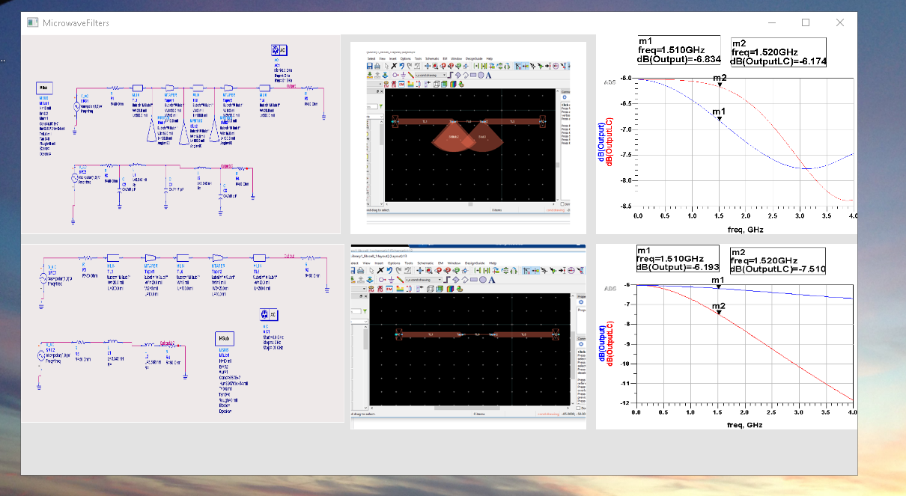

# Microwave-Engineering

The project provides details on wireless communications systems and the basic building blocks for the analog RF front end.  
Please click on the executable for details 

## Wireless Communication Systems

