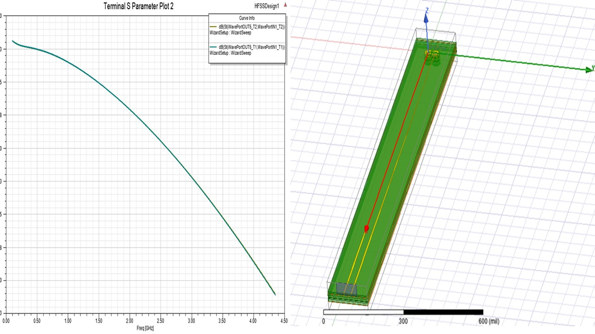
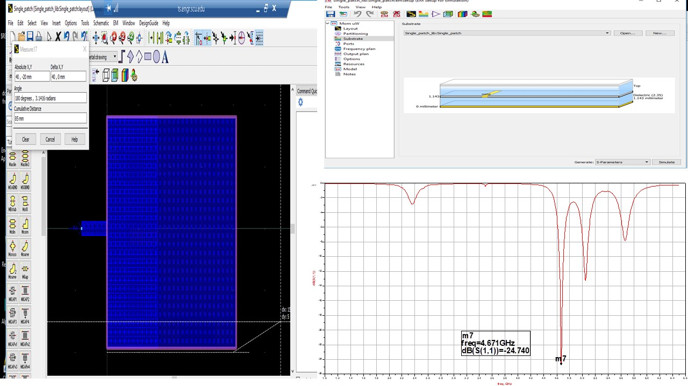
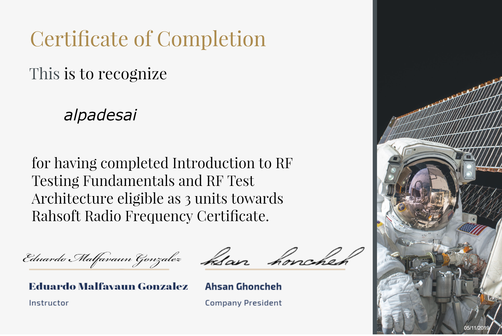
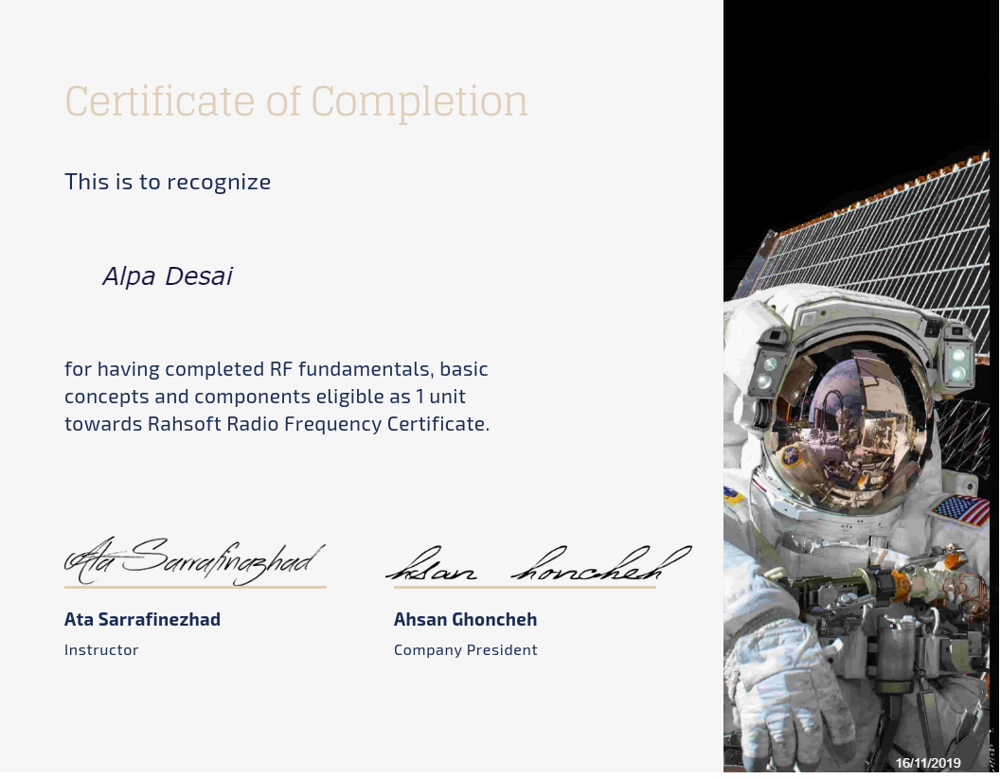

# Microwave Engineering

The project provides details on wireless communications systems and the basic building blocks for the analog RF front end.  Please click on the executable located in https://github.com/alpaddesai/Microwave-Engineering/releases for details.  All images are custom or have references.

Additional details reference : https://github.com/alpaddesai/AntennaDesign
