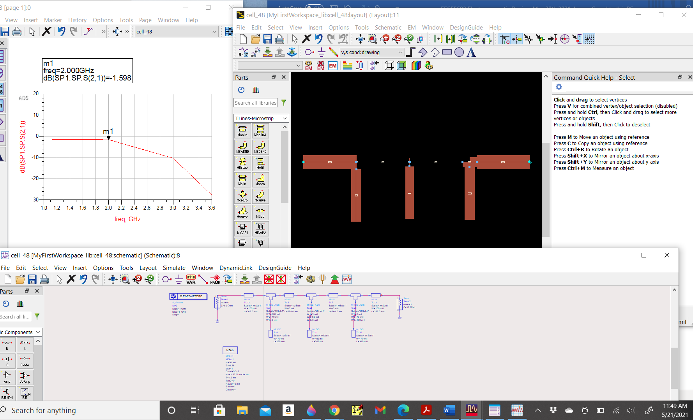

# Microwave Engineering

The project provides details on wireless communications systems and the basic building blocks for the analog RF front end.  Please click on the executable located in https://github.com/alpaddesai/Microwave-Engineering/releases for details.  All images are custom or have references.

# Transceiver Design

# Impedance matching and S Parameters

Ansys 

# Microwave Filters

ADS

# Wireless Communication

## Mixer

UWave office

# Rahsoft RF certifications

Additional details reference : https://github.com/alpaddesai/AntennaDesign, https://github.com/alpaddesai/RFDesign and https://github.com/alpaddesai/RFMicroelectronics
